---
## Front matter
title: "Шаблон отчёта по лабораторной работе 7"
subtitle: "Простейший вариант"
author: "Абдуллахи Бахара "

## Generic otions
lang: ru-RU
toc-title: "Содержание"

## Bibliography
bibliography: bib/cite.bib
csl: pandoc/csl/gost-r-7-0-5-2008-numeric.csl

## Pdf output format
toc: true # Table of contents
toc-depth: 2
lof: true # List of figures
lot: true # List of tables
fontsize: 12pt
linestretch: 1.5
papersize: a4
documentclass: scrreprt
## I18n polyglossia
polyglossia-lang:
  name: russian
  options:
	- spelling=modern
	- babelshorthands=true
polyglossia-otherlangs:
  name: english
## I18n babel
babel-lang: russian
babel-otherlangs: english
## Fonts
mainfont: PT Serif
romanfont: PT Serif
sansfont: PT Sans
monofont: PT Mono
mainfontoptions: Ligatures=TeX
romanfontoptions: Ligatures=TeX
sansfontoptions: Ligatures=TeX,Scale=MatchLowercase
monofontoptions: Scale=MatchLowercase,Scale=0.9
## Biblatex
biblatex: true
biblio-style: "gost-numeric"
biblatexoptions:
  - parentracker=true
  - backend=biber
  - hyperref=auto
  - language=auto
  - autolang=other*
  - citestyle=gost-numeric
## Pandoc-crossref LaTeX customization
figureTitle: "Рис."
tableTitle: "Таблица"
listingTitle: "Листинг"
lofTitle: "Список иллюстраций"
lotTitle: "Список таблиц"
lolTitle: "Листинги"
## Misc options
indent: true
header-includes:
  - \usepackage{indentfirst}
  - \usepackage{float} # keep figures where there are in the text
  - \floatplacement{figure}{H} # keep figures where there are in the text
---

# Цель работы

Изучение команд условного и безусловного переходов. Приобретение навыков написания
программ с использованием переходов. Знакомство с назначением и структурой файла
листинга.

# Задание

7.3. Порядок выполнения лабораторной работы

7.3.1. Реализация переходов в NASM

1- Создайте каталог для программам лабораторной работы № 7, перейдите в него и со-
здайте файл lab7-1.asm:

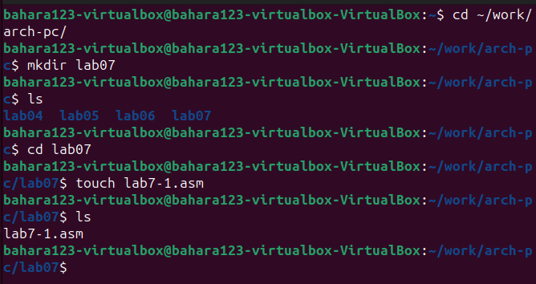{#fig:001 width=100%}

2- Инструкция jmp в NASM используется для реализации безусловных переходов. Рассмот-
рим пример программы с использованием инструкции jmp. Введите в файл lab7-1.asm
текст программы из листинга 7.1.

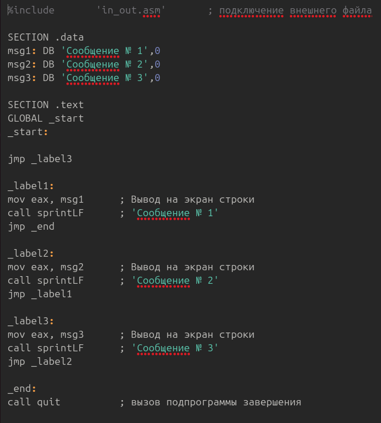{#fig:001 width=100%}

Создайте исполняемый файл и запустите его. Результат работы данной программы будет
следующим:Создайте исполняемый файл и запустите его. Результат работы данной программы будет
следующим:

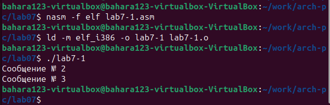{#fig:001 width=100%}

Таким образом, использование инструкции jmp _label2 меняет порядок исполнения
инструкций и позволяет выполнить инструкции начиная с метки _label2, пропустив вывод
первого сообщения.
Инструкция jmp позволяет осуществлять переходы не только вперед но и назад. Изменим
программу таким образом, чтобы она выводила сначала ‘Сообщение № 2’, потом ‘Сообщение
№ 1’ и завершала работу. Для этого в текст программы после вывода сообщения № 2 добавим
инструкцию jmp с меткой _label1 (т.е. переход к инструкциям вывода сообщения № 1)
и после вывода сообщения № 1 добавим инструкцию jmp с меткой _end (т.е. переход к
инструкции call quit). Измените текст программы в соответствии с листингом 7.2.

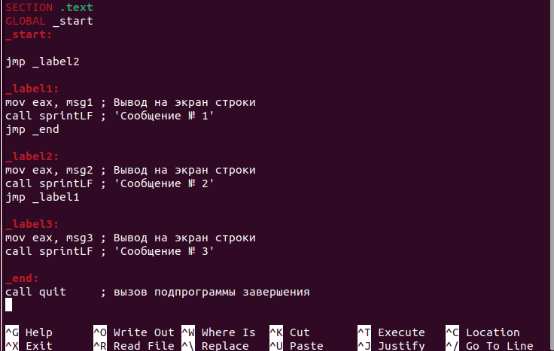{#fig:001 width=100%}

{#fig:001 width=100%}

Создайте исполняемый файл и проверьте его работу.
Измените текст программы добавив или изменив инструкции jmp, чтобы вывод програм-
мы был следующим:
user@dk4n31:~$ ./lab7-1
Сообщение № 3
Сообщение № 2
Сообщение № 1
user@dk4n31:~$

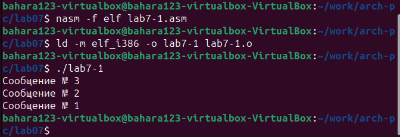{#fig:001 width=100%}

3- Использование инструкции jmp приводит к переходу в любом случае. Однако, часто при
написании программ необходимо использовать условные переходы, т.е. переход дол-
жен происходить если выполнено какое-либо условие. В качестве примера рассмотрим
программу, которая определяет и выводит на экран наибольшую из 3 целочисленных
переменных: A,B и C. Значения для A и C задаются в программе, значение B вводиться с
клавиатуры.

Создайте файл lab7-2.asm в каталоге ~/work/arch-pc/lab07. Внимательно изучите текст
программы из листинга 7.3 и введите в lab7-2.asm.

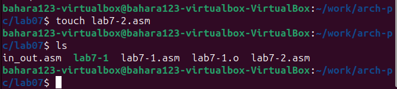{#fig:001 width=100%}

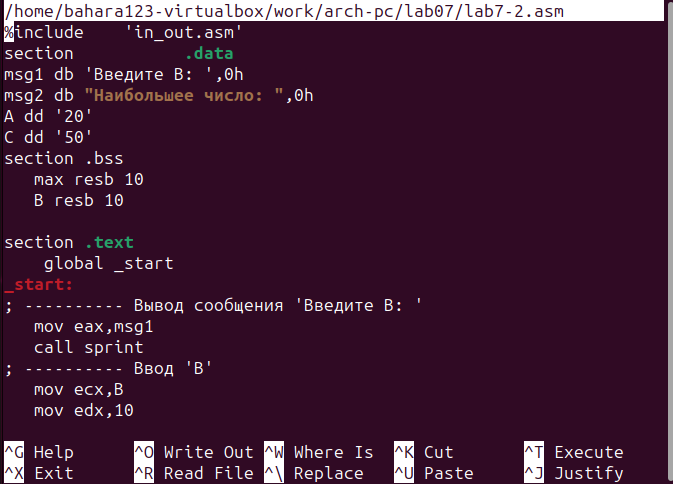{#fig:001 width=100%}

Создайте исполняемый файл и проверьте его работу для разных значений B.
Обратите внимание, в данном примере переменные A и С сравниваются как символы, а
переменная B и максимум из A и С как числа (для этого используется функция atoi преобра-
зования символа в число). Это сделано для демонстрации того, как сравниваются данные.
Данную программу можно упростить и сравнивать все 3 переменные как символы (т.е. не
использовать функцию atoi). Однако если переменные преобразовать из символов числа,
над ними можно корректно проводить арифметические операции.

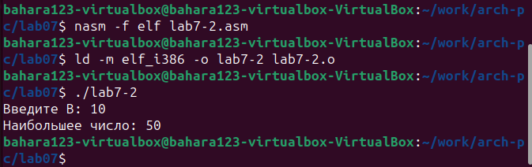{#fig:001 width=100%}

7.3.2. Изучение структуры файлы листинга

4- Обычно nasm создаёт в результате ассемблирования только объектный файл. Получить
файл листинга можно, указав ключ -l и задав имя файла листинга в командной строке.
Создайте файл листинга для программы из файла lab7-2.asm

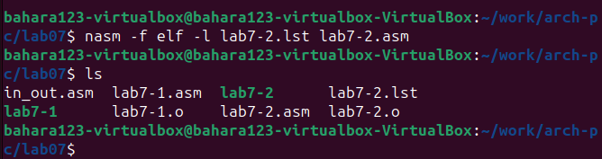{#fig:001 width=100%}

Откройте файл листинга lab7-2.lst с помощью любого текстового редактора, например
mcedit:

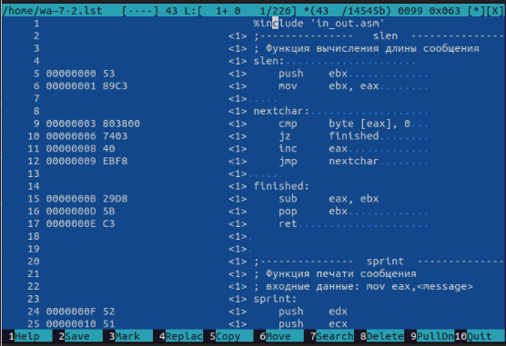{#fig:001 width=100%}

Внимательно ознакомиться с его форматом и содержимым. Подробно объяснить содержи-
мое трёх строк файла листинга по выбору.
Откройте файл с программой lab7-2.asm и в любой инструкции с двумя операндами
удалить один операнд. Выполните трансляцию с получением файла листинга:

{#fig:001 width=100%}

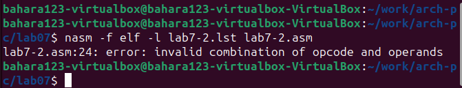{#fig:001 width=100%}

7.4. Задание для самостоятельной работы

1- Напишите программу нахождения наименьшей из 3 целочисленных переменных 𝑎,𝑏 и .
Значения переменных выбрать из табл. 7.5 в соответствии с вариантом, полученным
при выполнении лабораторной работы № 7. Создайте исполняемый файл и проверьте
его работу.

{#fig:001 width=100%}

{#fig:001 width=100%}

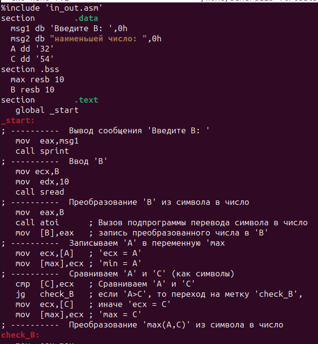{#fig:001 width=100%}
# Теоретическое введение

Для реализации ветвлений в ассемблере используются так называемые команды передачи
управления или команды перехода. Можно выделить 2 типа переходов:

• условный переход – выполнение или не выполнение перехода в определенную точку
программы в зависимости от проверки условия.

• безусловный переход – выполнение передачи управления в определенную точку про-
граммы без каких-либо условий.

# Выполнение лабораторной работы

Описываются проведённые действия, в качестве иллюстрации даётся ссылка на иллюстрацию (рис. @fig:001).

{#fig:001 width=70%}

# Выводы

Здесь кратко описываются итоги проделанной работы.

# Список литературы{.unnumbered}

::: {#refs}
:::
