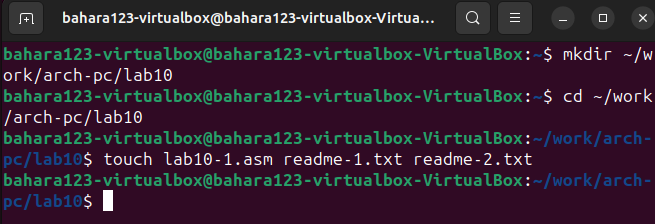
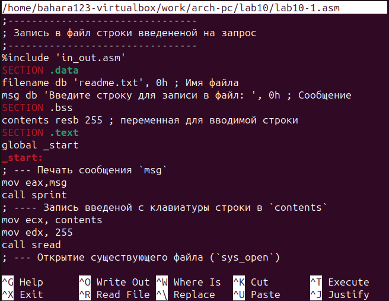
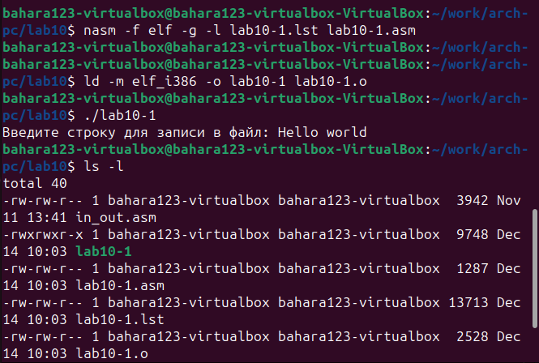
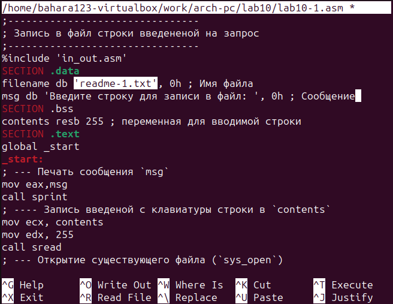
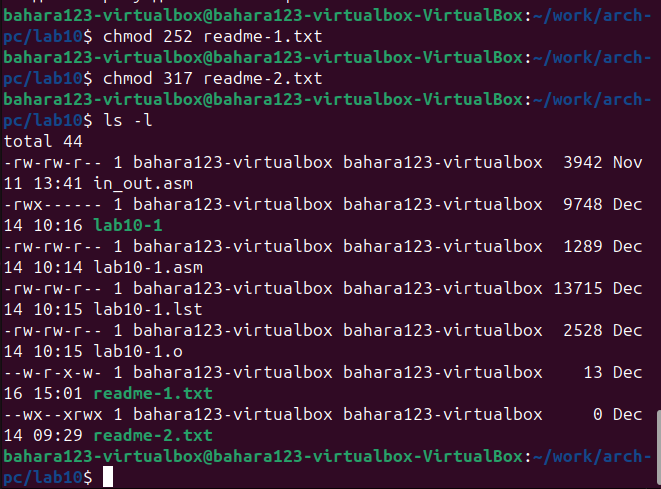
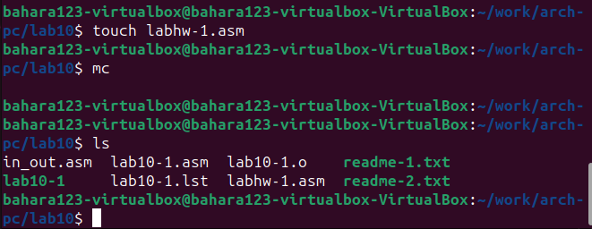
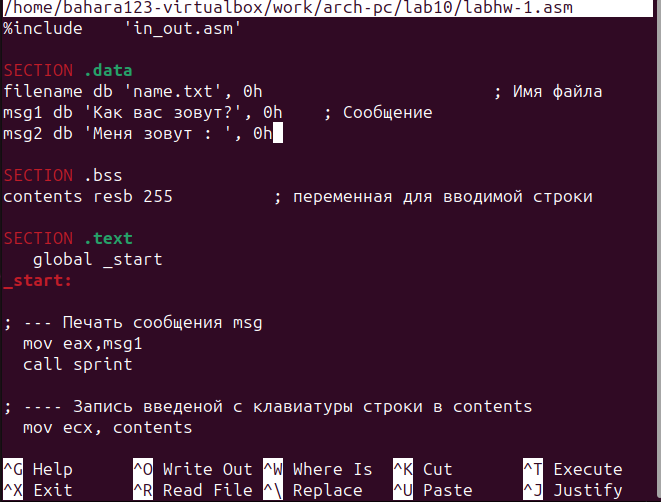
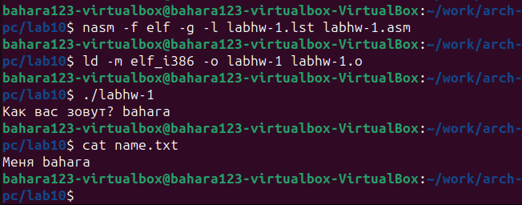

---
## Front matter
title: "Шаблон отчёта по лабораторной работе 10"
subtitle: "Простейший вариант"
author: "Абдуллахи Бахара"

## Generic otions
lang: ru-RU
toc-title: "Содержание"

## Bibliography
bibliography: bib/cite.bib
csl: pandoc/csl/gost-r-7-0-5-2008-numeric.csl

## Pdf output format
toc: true # Table of contents
toc-depth: 2
lof: true # List of figures
lot: true # List of tables
fontsize: 12pt
linestretch: 1.5
papersize: a4
documentclass: scrreprt
## I18n polyglossia
polyglossia-lang:
  name: russian
  options:
	- spelling=modern
	- babelshorthands=true
polyglossia-otherlangs:
  name: english
## I18n babel
babel-lang: russian
babel-otherlangs: english
## Fonts
mainfont: PT Serif
romanfont: PT Serif
sansfont: PT Sans
monofont: PT Mono
mainfontoptions: Ligatures=TeX
romanfontoptions: Ligatures=TeX
sansfontoptions: Ligatures=TeX,Scale=MatchLowercase
monofontoptions: Scale=MatchLowercase,Scale=0.9
## Biblatex
biblatex: true
biblio-style: "gost-numeric"
biblatexoptions:
  - parentracker=true
  - backend=biber
  - hyperref=auto
  - language=auto
  - autolang=other*
  - citestyle=gost-numeric
## Pandoc-crossref LaTeX customization
figureTitle: "Рис."
tableTitle: "Таблица"
listingTitle: "Листинг"
lofTitle: "Список иллюстраций"
lotTitle: "Список таблиц"
lolTitle: "Листинги"
## Misc options
indent: true
header-includes:
  - \usepackage{indentfirst}
  - \usepackage{float} # keep figures where there are in the text
  - \floatplacement{figure}{H} # keep figures where there are in the text
---

# Цель работы
Приобретение навыков написания программ для работы с файлами.

# Задание

# Порядок выполнения лабораторной работы
1. Создайте каталог для программам лабораторной работы No 10, перейдите в него и
создайте файлы lab10-1.asm, readme-1.txt и readme-2.txt:

{#fig:fig1 width=100% }

1.2 Введите в файл lab10-1.asm текст программы из листинга 10.1 (Программа записи в
файл сообщения). Создайте исполняемый файл и проверьте его работу.

{#fig:fig1 width=100% }

{#fig:fig1 width=100% }

Результат работы программы:
user@dk4n31:~$ nasm -f elf -g -l main.lst main.asm
user@dk4n31:~$ ld -m elf_i386 -o main main.o
user@dk4n31:~$ ./main
Введите строку для записи в файл: Hello world!
user@dk4n31:~$ ls -l
-rwxrwxrwx 1 user user 20 Jul 2 13:06 readme.txt
-rwxrwxrwx 1 user user 11152 Jul 2 13:05 main
-rwxrwxrwx 1 user user 1785 Jul 2 13:03 main.asm
-rwxrwxrwx 1 user user 22656 Jul 2 13:05 main.lst
-rwxrwxrwx 1 user user 4592 Jul 2 13:05 main.o
user@dk4n31:~$ cat readme.txt
Hello world!
user@dk4n31:~$

{#fig:fig1 width=100% }

{#fig:fig1 width=100% }

1.3 С помощью команды chmod измените права доступа к исполняемому файлу lab10-1,
запретив его выполнение. Попытайтесь выполнить файл. Объясните результат.

{#fig:fig1 width=100% }

1.4 С помощью команды chmod измените права доступа к файлу lab10-1.asm с исходным
текстом программы, добавив права на исполнение. Попытайтесь выполнить его и
объясните результат.

{#fig:fig1 width=100% }

1.5 В соответствии с вариантом в таблице 10.4 предоставить права доступа к файлу readme-
1.txt представленные в символьном виде, а для файла readme-2.txt – в двочном виде.
Проверить правильность выполнения с помощью команды ls -l.

6:     -w- r-x -w-        011 001 111

{#fig:fig1 width=100% }

# Задание для самостоятельной работы

1. Напишите программу работающую по следующему алгоритму:
• Вывод приглашения “Как Вас зовут?”
• ввести с клавиатуры свои фамилию и имя
• создать файл с именем name.txt
• записать в файл сообщение “Меня зовут”
• дописать в файл строку введенную с клавиатуры
• закрыть файл

{#fig:fig1 width=100% }

{#fig:fig1 width=100% }

{#fig:fig1 width=100% }

# Теоретическое введение

Здесь описываются теоретические аспекты, связанные с выполнением работы.

Например, в табл. @tbl:std-dir приведено краткое описание стандартных каталогов Unix.

: Описание некоторых каталогов файловой системы GNU Linux {#tbl:std-dir}

| Имя каталога | Описание каталога                                                                                                          |
|--------------|----------------------------------------------------------------------------------------------------------------------------|
| `/`          | Корневая директория, содержащая всю файловую                                                                               |
| `/bin `      | Основные системные утилиты, необходимые как в однопользовательском режиме, так и при обычной работе всем пользователям     |
| `/etc`       | Общесистемные конфигурационные файлы и файлы конфигурации установленных программ                                           |
| `/home`      | Содержит домашние директории пользователей, которые, в свою очередь, содержат персональные настройки и данные пользователя |
| `/media`     | Точки монтирования для сменных носителей                                                                                   |
| `/root`      | Домашняя директория пользователя  `root`                                                                                   |
| `/tmp`       | Временные файлы                                                                                                            |
| `/usr`       | Вторичная иерархия для данных пользователя                                                                                 |

Более подробно об Unix см. в [@gnu-doc:bash;@newham:2005:bash;@zarrelli:2017:bash;@robbins:2013:bash;@tannenbaum:arch-pc:ru;@tannenbaum:modern-os:ru].

# Выполнение лабораторной работы

Описываются проведённые действия, в качестве иллюстрации даётся ссылка на иллюстрацию (рис. @fig:001).

{#fig:001 width=70%}

# Выводы

Здесь кратко описываются итоги проделанной работы.

# Список литературы{.unnumbered}

::: {#refs}
:::
